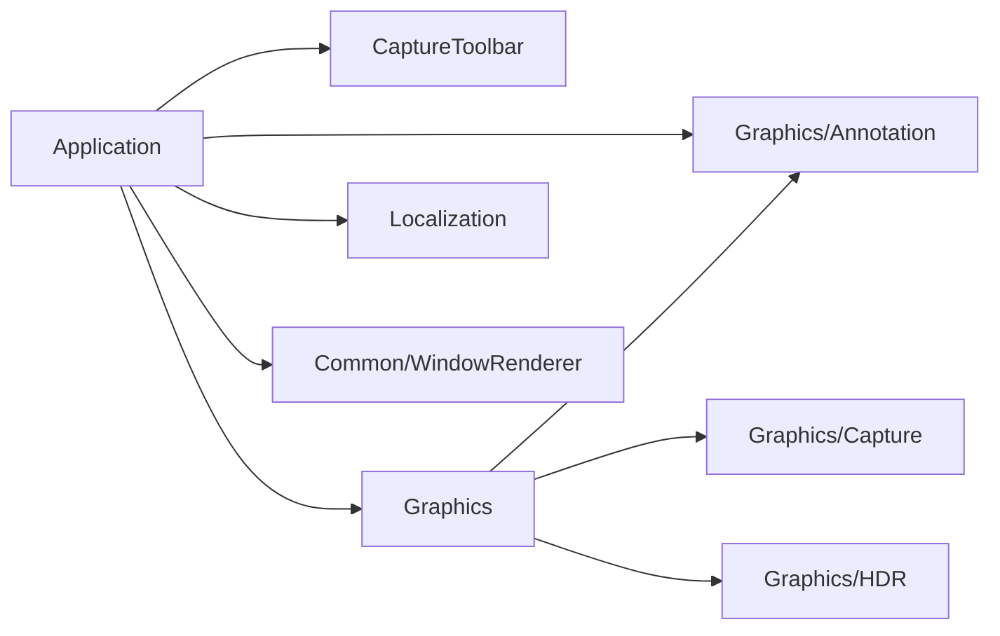

# 标注右键属性方案

日期：2026-09-16。状态：用户已批准，代码与自动回归完成，实际界面待验收。
验证结果见 [实施报告](../annotation-element-properties-implementation-2026-09-16.md)。
本方案替代 M1 的“截图遮罩右键与 Esc 共用取消入口”，并增加此前后置的单元素属性编辑。
2026-09-16 补充：用户已批准属性实时预览，沿用下面的单次提交及取消恢复语义。

## 1. 交互

- 取消截图遮罩中的右键分层取消行为；Esc 本身保留现有取消层级。
- 选择工具或任意绘图工具空闲时，右键命中一个已提交元素，直接打开“元素属性”窗口，不再多加一层菜单。
- 空白、选区外或没有正式选区时右键不操作，不清空选区、不切工具、不退出截图。
- 绘制、移动或缩放进行中，右键忽略；不取消、不提交当前手势，也不在手势结束后补开窗口。
  只有从空闲状态开始且同一会话内完成的右键点击才可打开属性，右键拖动不作为属性点击。
- 左键职责不变：选择工具操作整个截图区域，绘图工具继续绘制；不新增对象拖动模式或对象控制点。
- 保存、复制和置顶贴图的完成行为不变；已创建贴图窗口自己的右键菜单也不受影响。

## 2. 命中

命中仅检查当前正式选区内的已提交元素，不检查草稿、选框、控制点、工具栏或冻结底图中的图形。
先按叠放逆序做几何命中，选择最上层、透明度小于 100% 的元素。

- 空心矩形只命中描边，内部空白不会选中它。
- 箭头检查实际箭头轮廓，不能用外接矩形代替。
- 直角填充检查填充区域；圆角填充排除圆角外的空白。
- 上层不透明元素覆盖处只命中上层；半透明叠放处也先编辑最上层有覆盖贡献的元素，不自动穿透。
- 所有精确几何均未命中时，才对细描边／箭头提供建议 3 DIP 的点击容差，按点击屏 DPI 换算；
  容差不越过正式选区，不抢占已经精确命中的其他元素。填充对象不按外接框扩张命中。
- 使用与绘制一致的形状、线宽、圆角半径和坐标变换；不承诺与任意抗锯齿边缘逐像素完全相同。

优先在 Graphics 中复用 D2D 几何及当前箭头轮廓，提供返回元素稳定 ID 的命中入口。
如需提取共享几何构造，保持渲染外观不变；Annotation 纯模型仍不依赖 D2D、Capture 或 App。
仅在右键点击时查询，不增加鼠标悬停轮询或逐帧命中扫描。

## 3. 单元素属性

复用现有样式窗口，标题明确为“元素属性”，初始值来自被点击元素，而非当前工具默认值。
可改颜色和透明度；空心矩形／箭头同时允许改线宽，填充矩形隐藏线宽。
本步不增加圆角半径、形状类型、位置、尺寸或图层顺序编辑。

确认后只替换该元素的样式，保持其 ID、几何和叠放位置；当前工具和其默认颜色／透明度不变。
取消、关闭或没有实际变化不修改文档、不新增历史、不清空 redo。
有效修改作为一条原子编辑，Ctrl+Z 恢复该元素原属性，重做恢复修改；失败保留原文档和完整历史。

调整颜色、透明度或线宽时，所有字段有效才实时预览目标元素；输入未完成或无效时保留上次有效画面。
初始化控件不触发预览，连续相同的成功值不重复刷新。取消、关闭或 Esc 清除临时预览并恢复打开前样式。
整个调整过程不修改 committed、文档修订、工具默认值或历史；确认只提交最终值一次，改回原值不记历史。
预览失败保留上次有效画面，窗口显示错误并禁止确认；后续有效输入可重试候选，确认入口也重新校验。

已有元素可以改成 100% 透明，保留 ID 与历史；它此后不再参与右键命中，可立即 Ctrl+Z 恢复。
这与“新建完全透明手势不提交对象”的 M1 规则分开处理，不增加不可见对象选择框。

## 4. 生命周期与输出

右键按下／抬起及排队处理使用同一会话准入，固定目标 ID、文档修订和原属性。
属性窗口全程沿用完成忙状态，屏蔽所有遮罩编辑、输出和重复属性请求。
确认时重新核验会话未失效、目标仍属于固定文档修订；不能将旧点击或旧属性提交到另一元素／新截图。
显示变化、窗口销毁及退出仍先标记，模态返回后清理，避免释放被窗口借用的会话资源。

提交成功后使用新不可变文档快照统一重绘两屏；复制、保存和贴图自然消费更新后的快照。
不另建合成链、不修改 HDR／Present、不写临时图片或持久化元素属性。

临时预览由 Application 的 CaptureAnnotationState 统一持有，每次调用 Annotation 的纯文档操作仅替换目标样式，避免累积修改。
`AnnotationForDrawing` 优先提供这份临时快照，依然由原有统一重绘批次同时供所有屏幕使用。
回调同步执行，校验固定对象文档、修订及会话仍有效；显示失效后拒绝新预览，模态返回时统一清理。
无论确认、取消、异常还是创建失败，返回后均清除临时快照；有效会话重新绘制最终 committed。

## 5. 范围与验证

预计修改 App 的右键分派、属性编排、单元素事务与历史提交；Graphics 的共享几何／命中入口；
必要的样式窗口标题适配、本地化、对应测试及文档。Toolbar 的默认样式入口、左键选区模型和导出模块内部不变。

测试覆盖：

- 空白右键、区外右键、未选区和活动手势右键无取消副作用，Esc 保持原行为。
- 四类几何的边界、空心内部、圆角空白、重叠层次、透明元素、负坐标、跨屏与 DPI 容差。
- 只更新目标元素，默认样式／其他对象／几何／顺序不变；确认一步撤销，没有变化或取消不动历史。
- 100% 透明后跳过命中及撤销恢复；旧点击、旧修订、元素失效和模态期间其他屏幕输入被拒绝。
- 新属性预览与最终合成一致，错误或取消保持当前工具和有效截图会话。

执行 Debug／Release 构建及受影响模块回归，再做实际右键与属性窗口检查。
此前 Computer Use 应用授权超时不作为本功能已通过界面验收的证据。

## 6. 审核依据

子 Agent 已只读审核最小交互、命中语义、透明元素和历史边界。
技术可复用现有 D2D 几何；[StrokeContainsPoint](https://learn.microsoft.com/en-us/windows/win32/direct2d/id2d1geometry-strokecontainspoint)
支持按线宽和变换检查描边，填充使用相应填充几何命中。
文档中的点击容差是产品交互容差，不等同于几何展平精度参数。

此项新增了原方案后置的单元素编辑入口，用户明确回复“同意方案”后按本方案施工。

## 7. 模块依赖情况

本功能没有独立的新模块；结构整改后，属性表单属于 Application，复用已有 Common/WindowRenderer。

| 调用方 → 被依赖方 | 接口与用途 | 依赖性质 |
| --- | --- | --- |
| Application → Graphics | `HitTestAnnotations` 返回稳定 ID；`OverlayRenderer` 消费不可变快照 | App 私有链接 Graphics；命中几何与绘制共用 |
| Application → Annotation | 对象／样式／快照及 `AppendAnnotation／ReplaceAnnotationStyle／TranslateAnnotations／ParseAnnotationColor` | 公开链接纯模型；事务及共同历史由 CaptureAnnotationState 管理 |
| Graphics → Annotation／Capture／HDR | 对象样式、冻结帧及色彩处理 | Graphics 的现有公开依赖，实时预览不增加新边 |
| Application → CaptureToolbar | 工具按钮、状态和命令回调 | 私有链接；Toolbar 不再拥有属性窗口或样式草稿 |
| Application → WindowRenderer | `ShowAnnotationStyleDialog` 在 Application 内调用公共 Bind／ShowModal 接口 | 私有链接既有公共目标；只补通用 swatch、RefreshValue 和 topmost |
| Application → Localization | `GetUiText` 注入标题与错误文字 | App 私有链接；Toolbar 不直接查 JSON 或引用本地化模块 |

CaptureToolbar 仍只依赖标准库、统一编译选项和 `user32／gdi32／comctl32`；
Graphics 的 D2D、D3D、DXGI、WIC 及 Common 依赖保持原状。Annotation 不依赖 Windows 或任何父级／兄弟模块。
App 的预览回调只委托 CaptureAnnotationState 属性事务；状态层使用 Annotation 的不可变文档操作，App 不再复制文档或保存另一份属性预览。
表单的颜色原文经 ParseAnnotationColor 校验，公共色块只接收数值 RGB；普通控件、DPI、owner 与消息循环统一复用 WindowRenderer。
工具栏默认样式窗口不传预览回调，继续只改后续绘制默认值；右键元素属性才启用实时预览。
本步不新增 CMake target、第三方库、窗口渲染链或导出依赖，完整标注依赖见 [总体方案第 5.1 节](annotation-v0.3.md#51-当前模块依赖情况)。
