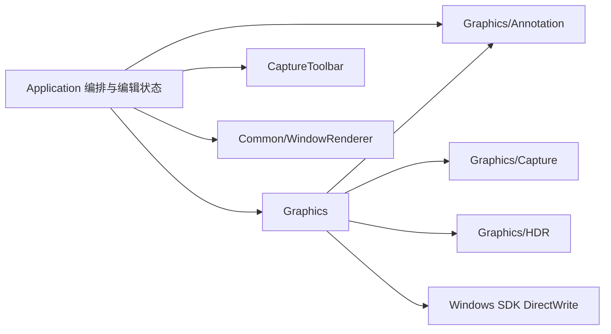

# 标注 M2／M3 施工设计

日期：2026-09-17。状态：用户已批准，M2／M3 代码及职责整改已完成，用户确认四组实机验收通过；自动验证和实际验收边界见
[M2 实施记录](../annotation-m2-implementation-2026-09-17.md)、[M3 实施记录](../annotation-m3-implementation-2026-09-17.md)。
后续职责整改经用户批准，当前边界以本文第 3 节及决策 D-073 为准；本轮验证见 [实现进度](../implementation_progress.md)。
依据：[总体方案](annotation-v0.3.md)、[结构整改](../annotation-structure-refactor-2026-09-16.md)、
[开发规范](../development.md)。用户已选择 M3 文字“直接在截图上原位输入”，不采用另开浮动表单输入正文。

## 1. 交付范围与不变规则

| 阶段 | 交付 | 首版交互 |
| --- | --- | --- |
| M2 | 自由画笔、直线、空心椭圆、局部橡皮擦 | 画笔按住绘制；直线／椭圆拖出几何；橡皮连续擦除局部内容 |
| M3 | 原位多行文字、四档马赛克 | 点击添加文字；马赛克拖出矩形区域，粗细为 4／8／16／32 物理像素，默认 16 |

依次实现并验收 M2、M3；不把全部改动一次堆入 App。
选择工具仍只移动／八点缩放截图区域；其他工具只编辑选区，工具栏持续标识当前工具。
标注随截图区域整体平移，改变边界只裁剪；现有右键属性、实时预览、取消恢复、确认一步撤销继续适用。
Esc 保留当前操作／工具／选区的取消层级；右键不取消，活动手势时忽略。
复制、保存、贴图使用同一最终合成入口，不输出编辑控件、控制点、原始图层或历史。
本次不增加 OCR、翻译、联网、压力感应、富文本、对象左键拖动或独立对象缩放。

## 2. 复用清单与实际缺口

| 需求 | 已有能力 | 实际缺口与扩展位置 |
| --- | --- | --- |
| 文档变更 | Annotation 不可变追加、查找、属性替换、平移、颜色解析 | 在纯模型扩展路径、擦除引用、文字与马赛克参数，以及对应操作；禁止 App 自行操作对象数组 |
| 预览／历史 | CaptureAnnotationState 统一 preview、属性事务、修订、共同历史 | 扩展手势种类与对象编辑事务，使其接受文本内容／块大小；不另设第二份预览或撤销栈 |
| 形状与命中 | Graphics 共享 D2D 几何、精确优先命中、统一重绘 | 新增线／路径／椭圆、擦除裁剪、DirectWrite 布局、马赛克来源；命中同步排除擦除区域 |
| 属性 UI | WindowRenderer 的 edit、integer／slider、select、swatch、模态与单控件刷新 | 现有表单足以承载笔宽、橡皮大小、字号及马赛克档位，不再写一套表单 |
| 原位文字 | 现有 Renderer 有原生文本输入及字体／编码处理，但只提供完整窗口与单行 edit | Common/WindowRenderer 内增加通用 InlineTextEditor；提取双方实际共用的输入辅助能力，不复制旧实现 |
| 文本快捷键 | 现有 Renderer 的窗口导航及 Hotkeys 会话匹配 | 原位编辑需独立多行／IME 组合准入，不能让 Enter／Esc 被截图或表单默认动作抢走 |
| 输出 | 固定冻结来源、HDR→SDR、统一标注合成 | 马赛克读取未标注 SDR 来源；Graphics 管理有界来源块缓存，不能再次对已转换的结果做 Tone Map |

方案制定时 AnnotationObject 只有四种几何及标量样式，单快照预算仅估算对象数组。
M2／M3 已扩展载荷和多快照深层去重计费，计入共享路径、字符串及擦除记录；后续整改移除单快照薄包装，
生产与测试统一使用 AnnotationDocumentsStorageBytes，不能沿用 sizeof 对象作为完整预算。

## 3. 模块职责与依赖

| 模块／类 | 拥有的能力和状态 | 禁止承担的职责 |
| --- | --- | --- |
| Annotation | 形状和载荷、不可变路径／文本／擦除引用、文档变换、属性校验与存储统计 | HWND、D2D、输入法、冻结像素、选区窗口与 UI |
| CaptureAnnotationState | 唯一文档／预览／事务／历史，工具默认值；描画、擦除、文字和对象编辑事务 | 控件创建、图形设备、逐像素合成 |
| Graphics | 几何、实际覆盖与命中、擦除裁剪、DirectWrite 布局、冻结来源马赛克、图形缓存 | 窗口表单、输入法、历史所有权 |
| App | 输入准入、跨屏生命周期、属性表单事务编排、模态／输出忙状态、重绘和最终输出 | 文档修改算法、路径／像素化算法、交互状态副本或编辑器基础设施 |
| AnnotationInteractionController（Application 私有） | 右键资格、属性请求、原位控件、延后文字完成；借用唯一编辑状态到 CloseSession | 完整 App 访问、图形资源、文档副本、历史栈和工具栏完成预订 |
| OverlayInputQueue（Application 私有） | 延后指针事件、重放与取消屏障；独立 8192 条上限 | 文档、窗口绘制、笔迹采样规则及截图会话所有权 |
| CaptureToolbar | 工具图标、布局、状态、稳定命令 | 属性窗口、笔迹、文字草稿或马赛克计算 |
| Common/WindowRenderer | 通用表单与原位文字输入控件、字体／编码辅助、焦点／IME／控件内编辑行为 | Annotation 类型、截图工具、擦除规则、文档提交或历史策略 |

AnnotationInteractionController 和 OverlayInputQueue 是 Application 内部组件，不增加独立 CMake 模块。
控制器随 App 存活，跨会话单调请求序号不得重置；关闭会话清除资格和状态借用，使旧消息失效。
原位控件回调返回后再销毁，提交失败以 Resume 保留同一控件的文字撤销。App 的 CompletionBusy()
合并查询模态／输出忙状态和控制器 TextActive()，不保存第二份文字忙标志。
字号和马赛克档位唯一来源为 Annotation，橡皮直径档位唯一来源为编辑状态层；默认属性和元素属性表单复用这些列表。
基础样式规则由 Annotation 提供；工具保留线宽至少 1，界面保留离散预设子集，纯文档允许大于 0 的有限线宽至 256。
旧 Style 入口已由通用对象属性事务取代，迁移测试覆盖原场景后移除，避免长期维护无生产调用的包装。

Application 已依赖 WindowRenderer、Annotation 和 Graphics；不新增兄弟模块反向依赖。
DirectWrite 属 Windows SDK，在 M3 实际使用时由 Graphics 私有链接；InlineTextEditor 使用的原生输入能力归公共控件。
普通属性表单继续使用既有绑定／布局，原位控件是针对不同宿主方式的实际缺口，不重做整套表单窗口。
新增公共接口必须同时有通用控件测试及产品调用；核心文档操作必须由状态层真实使用。

## 4. M2 绘制与擦除

### 4.1 画笔、直线、椭圆

- 画笔由对象原点加局部采样点构成，圆端点／圆连接；单击产生一个笔宽大小的点。
- 直线使用两个端点，圆端点；零长度手势不提交。椭圆拖拽确定外接矩形，反向拖动有效，零面积不提交。
- 使用现有颜色、透明度和 1／2／3／5／8 px 线宽；透明度 100% 的新绘制不产生对象或历史。
- 每次手势一条历史。取消／失捕／分配失败回到开始前文档，不清空 redo。
- 开始位置必须在选区内；绘制几何保持物理坐标，显示和输出裁剪到当前选区，保持现有几何标注规则。
- 采样合并重复坐标；保留首尾点与转折，不引入未审核的自动平滑或悄悄降低精度。

### 4.2 局部橡皮擦

- 首版大小建议直径 8／16／32／64 px，默认 16；圆形覆盖，连续点之间扫过连贯区域，不能留下采样空洞。
- 以按下时文档作为基线，擦到路径覆盖处所有已有对象，包括被上层遮住的标注；不修改冻结底图。
- 笔刷实际覆盖先与手势开始时的正式选区求交，不能只按中心点裁剪；选区外隐藏内容保留。
- Annotation 保存对象局部坐标的擦除引用。公共路径可以共享存储，每个对象记录自己的局部偏移与裁剪，避免同一轨迹复制到所有对象。
- 擦痕随对象平移，缩放选区不缩放擦痕；随后新建的对象不受旧轨迹影响。
- Graphics 计算实际几何扣除旧擦痕后的覆盖交集，再由状态层驱动 Annotation 更新受影响对象；
  不把 D2D 命中算法放入 Annotation，也不让 App 手写逐对象擦除。完全透明对象不产生可擦覆盖。
- 空擦不记录历史；一次拖动影响多个对象仍只需一次 Ctrl+Z 恢复。
- 已擦区域不会因修改颜色／线宽而自动恢复；擦除是固定局部覆盖，新线宽扩张到原擦除范围之外的部分可以显示。
- 同一覆盖规则供预览、命中和输出使用。M3 的文字与马赛克也接入这套擦除，不另写特例覆盖层。
- 重编辑正文或字号后，旧擦痕保留原对象局部位置，不按新字形重新映射；新文字落进旧擦区也被擦。
  原位编辑时允许控件显示未擦的完整正文供修改，确认后恢复带擦除掩码的最终画面。

## 5. M3 原位文字

### 5.1 交互

- 文字工具在选区内单击，直接在该落点出现可输入的编辑区域，不打开独立正文表单。
- 编辑期间允许临时边框／编辑底板及光标，确认后只保留透明背景文字；这些辅助外观不进入输出。
- 支持中英日、多行和输入法。首版采用统一字体样式，不做富文本；建议默认 Segoe UI 并使用系统字体回退。
- 首版字号建议 12／16／20／24／32／48 物理像素，默认 24；颜色与透明度使用现有属性表单，字号跨 DPI 不变。
- 文字以显式换行为准；首版不自动软换行，不增加文本框几何缩放。长行与超出范围内容按选区裁剪，输入控件允许滚动查看。
- Enter 换行，Ctrl+Enter 确认。输入法组合期间 Enter／Esc 先给输入法，不能触发截图输出或取消截图。
- Ctrl+Z／Ctrl+Y／Ctrl+C／Ctrl+V 在编辑期间作用于文字控件；Ctrl+S 不完成截图。组合中 Ctrl+Enter 不直接提交，结束组合后再确认。
- 无组合时 Esc 取消本次文字事务。点击选区内编辑框之外可确认，但吞掉该次点击，不同时开始另一笔。
  组合期间该点击不提交；选区外点击保持编辑。一般失焦不自动提交，显示失效／退出取消事务并清理控件。
- 正文输入期间不同时开启另一个属性窗口、切换工具、移动选区或完成截图；先确认／取消文字。
  颜色与字号可在创建前设置默认值，或完成文字后右键调整，避免引入并行编辑事务。
- 新建空白文本不产生对象或历史。编辑已有文字时，空白候选不删除旧对象，提示后继续编辑或取消；对象删除另行设计。
- 已有文字右键仍打开属性；其中提供“编辑文字”入口，确认当前有效属性后在原位置进入正文编辑，不借左键抢占选择工具。
  属性修改与随后正文修改各自是一笔可撤销编辑；未修改属性时不产生空历史。

### 5.2 原位输入组件边界

拟在 Common/WindowRenderer 内提供可独立使用的 InlineTextEditor，使用系统 RichEdit 的纯文本多行模式，
拥有可激活的 owned popup 输入宿主，外观直接位于截图文字落点；不是另开带标题的文本编辑表单。
只接收文本、字体、物理矩形、裁剪范围与输入／确认／取消回调，不接收标注对象或截图会话。
单个输入宿主可以覆盖屏幕边界，不挂在单屏遮罩 child 下以免父窗口裁断；App 负责固定 owner 和延迟回收。
复用／提取现有公共字体、编码及控件管理辅助，不把整个 WindowRenderer 表单硬嵌入截图。
普通 EDIT 的重做能力不能按转发 Ctrl+Y 来假定具备；选择系统 RichEdit 是为了复用其原生撤销／重做与输入能力，
不开放富文本产品功能、不在 App 自建文字编辑撤销栈，也不引入外部编辑器库。

当前对象编辑仍只有一个 CaptureAnnotationState 事务。控件维护的是原生输入缓存和控件内撤销，
回调把完整文本同步到该事务；不建立另一份可独立提交的标注文档或全局历史。
输入控件显示文字时，Graphics 不重复绘制同一活动文字；取消恢复旧对象，确认后由 Graphics 的统一文字布局显示。

原生输入控件与最终 DirectWrite 的字体栅格化不要求逐像素相同；落点、字号、显式换行及内容必须一致。
M3 首个检查点验证中文／日文输入法、负坐标、跨屏和混合 DPI；若必须改为完全透明自绘输入系统才能满足需求，
视为实质性技术范围变化，重新说明方案，不能静默把 IME／光标系统塞进 App。

## 6. M3 马赛克

- 拖出矩形区域；首版四档块边长 4／8／16／32 px，默认 16，按物理像素定义，跨 DPI 不改块大小。
- 马赛克始终读取未标注的冻结来源，不采当前桌面、不采编辑遮罩，也不把已有标注混入采样。
- 网格原点固定为本次冻结桌面的左上角，完整网格块使用已转换的 SDR 来源求通道平均；
  块先按统一网格计算，再裁剪到对象形状／擦除掩码／选区，不能对裁剪后小块重新平均而改变结果。
- 参与平均的范围为网格块与冻结虚拟桌面边界的交集；显示器间空洞沿用现有底图的黑色并计入平均。
  跨屏块先拼接各屏已经转换的 SDR 来源再统一平均，不能各屏独立截块取色；桌面边界之外不采样。
- 标注区域随截图选区移动，但改为像素化新位置的冻结画面；不能把旧位置的像素块当作贴纸拖过去。
- 默认档位影响后续对象，右键已有对象可以预览修改档位；不提供颜色或透明度来降低马赛克覆盖强度。
- 与其他标注按对象顺序合成；橡皮擦能擦开局部马赛克，露出当时的冻结底图。
- Graphics 对冻结来源的 SDR 转换和块化结果做有界缓存；键包含会话、来源坐标、颜色转换条件、档位与网格原点。
  选区移动、修改档位、撤销和新会话不能误用旧位置结果；绘制期间不能重新转换整张桌面或阻塞等待外部数据。
- 来源按固定网格的局部块准备，缓存未命中允许在 Graphics 中有界转换所需区域，不承诺零转换。
  初次进入工具及拖动扩展按需准备；准备失败保留旧有效预览、禁止提交失败候选并允许重试／取消，不显示未处理原图冒充马赛克。
- HDR 预览把所得 SDR 马赛克映射到目标颜色空间；最终输出直接使用同一 SDR 样本，不再次 Tone Map。

## 7. 命中、事务与预算

新对象继续先逆序精确命中，再按现有规则给细描边／路径提供 3 DIP 容差。
命中须扣除擦除空洞；文字使用实际文字覆盖而非包含大块空白的外接矩形，马赛克命中可见区域。
100% 透明对象跳过；右键编辑只作用于稳定 ID 与固定修订。

对象种类采用明确的载荷类型，路径／文本／擦除数据使用共享不可变存储，不能不断给所有对象叠加无关字段。
统一对象编辑事务容纳颜色、线宽、字体、正文和马赛克参数，保留 Begin／Update／Commit／Cancel 语义。
大块路径只复制本次改动的数据；一个笔迹草稿可追加构建，但已发布的绘制快照不能原地修改。

预算建议：沿用 1024 个对象、128 步历史、32 MiB 文档与历史；单次笔迹／擦除先限 8192 个采样点，单文本限 8192 个 UTF-16 代码单元。
动态路径、字符串、擦除引用及历史包装均计入预算，共享块按身份去重；活动草稿另设同级上限，不能绕过历史预算无限增长。
Graphics 新增缓存初始总上限建议 128 MiB，不含已有冻结帧与最终输出缓冲；采用局部／分块临时层，禁止每个对象分配全桌面位图。
缓存满时淘汰可重建内容；文档／草稿超限原子拒绝当前编辑并提示，不截断文字、不悄悄降低马赛克档位或擦除精度。
以上数值是待本方案确认的首轮上限，实施中需测量；实质改变预算或交互需要说明，不能在失败时静默降级。

## 8. 施工顺序与验收门槛

1. M2 先扩展 Annotation 载荷及纯操作、完整存储预算，再接编辑事务；分别测试无 GUI 的模型和事务。
2. Graphics 实现新几何与擦除；最后接工具栏／属性表单／App 输入，验证预览、命中与三种输出一致。
3. M2 Debug／Release、回归及跨屏实际检查完成后进入 M3，不把 M2 交付写成全部完成。
4. M3 先做原位输入与 IME／跨屏的技术验证，再接文本布局与对象编辑；文字需要原位输入，不能以浮动正文表单替代验收。
5. 在同一冻结来源和绘制链接入马赛克缓存、四档粗细及擦除；验证平移后采样新位置、历史恢复及缓存失效。
6. 每阶段独立检查模块职责、实际生产调用、重复实现与旧分支清理，子 Agent 监督；更新进度和实施报告。

必须覆盖：一笔一次撤销／重做；空擦无历史；越区擦除保留隐藏部分；重叠标注全部局部擦除；新对象不受旧擦痕影响；
路径或文字修改后的擦痕、右键属性取消／同值／失败；IME 组合、Ctrl+Z 归属、空文字、跨屏输入寿命；
4 档马赛克、负坐标网格、跨屏 HDR／SDR、来源不含标注、复制／保存／贴图结果；预算与缓存失败保留原文档。
重放已修复的跨屏拖动／缩放场景，分别观察输入延迟、重绘提交与实际显示，不能把提交次数当作显示帧率。
公共控件扩展须回归 Settings 等既有调用方；既有贴图冗余请求失败单独记录，不改断言凑全绿。

## 9. 审核与依据

子 Agent 已核对当前模型、事务、公共输入接口缺口，并复核局部擦除、马赛克移动来源和 IME 按键优先级。
用户已明确原位输入，并已批准本文的编辑底板、默认参数、空文字及右键重新编辑等细化。

微软文档说明原生多行控件的换行／滚动能力、RichEdit 的纯文本模式与重做能力，以及 DirectWrite 布局可供 Direct2D 绘制与命中查询：
[Edit Control Styles](https://learn.microsoft.com/en-us/windows/win32/controls/edit-control-styles)、
[EM_SETTEXTMODE](https://learn.microsoft.com/en-us/windows/win32/controls/em-settextmode)、
[EM_REDO](https://learn.microsoft.com/en-us/windows/win32/controls/em-redo)、
[IDWriteTextLayout](https://learn.microsoft.com/en-us/windows/win32/api/dwrite/nn-dwrite-idwritetextlayout)。
这些接口能力不等于本产品原位编辑与最终版式已验证；跨屏、IME 和背景隔离仍须按上述门槛测试。
