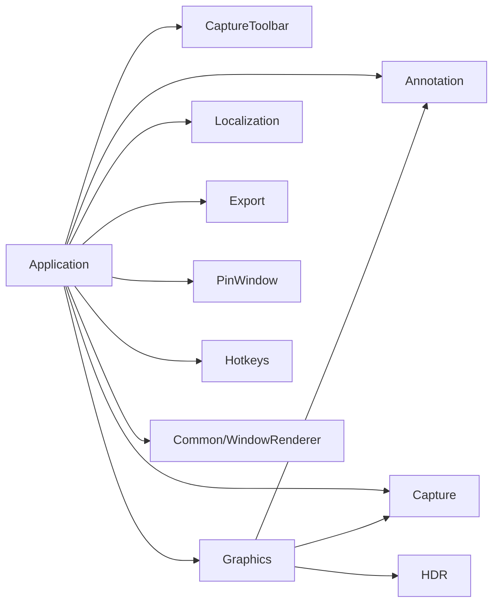

# 截图标注设计方案

日期：2026-09-15。状态更新：2026-09-16 M1 代码与自动验证完成，实际界面待验收；见 [M1 收尾](../annotation-m1-implementation-2026-09-16.md)。
2026-09-17：用户已批准 [M2／M3 细化施工设计](annotation-m2-m3-v0.3.md)，代码已接入；
当前结果见 [M2 实施记录](../annotation-m2-implementation-2026-09-17.md) 与 [M3 实施记录](../annotation-m3-implementation-2026-09-17.md)，实际界面仍待验收。
后续交互修订：[右键元素属性](annotation-element-properties-v0.3.md) 已获用户批准并接入实现，
右键取消改为单元素样式编辑，Esc 保持分层取消。
依据：[产品需求第 8–10 节](../product_requirements.md)、[开发规范](../development.md)。
本方案覆盖标注整体结构，并给出可独立验收的分阶段范围；阶段完成不等于全部标注工具已完成。

## 1. 设计时基线与目标

设计开始时只有冻结截图、选区操作和“取消／贴图／保存／复制”工具栏，没有标注对象或历史模型。
工具栏已有按钮选中／启用状态接口，但命令和图标校验仅接受四个现有操作，需要有范围地扩展。
`App::RenderOverlays` 刚完成多屏统一快照／批次重绘，新增标注必须沿用该入口，不能回退为各屏自行读取可变状态。
`CompleteSelection` 与 `PinSelection` 各自调用 `SelectionOutputRenderer::Render`，因此最终图像生成必须统一接入标注，
不能仅改保存／复制而漏掉贴图。

目标：选区内的标注在会话中可编辑，复制、保存和贴图取得同一张扁平化结果；退出后不保存原图、对象或历史。
冻结桌面保持不可变，未标注区域保持现有颜色语义，HDR→SDR 沿用既有一次转换链路。

## 2. 已确认要求与待确认选择

### 2.1 已确认

- 用户明确要求橡皮擦为**局部擦除**，不能以删除整个对象替代。
- 必须支持 **Ctrl+Z 撤回上一步编辑**；第一阶段就接入，不等到后续工具完成。
- 工具栏提供一个选择工具和其他绘图工具；完成框选后自动切换到选择工具。
  选择工具用于移动截图选区及八控制点缩放；其他工具只在框选区内绘制，不调整截图选区。
- 当前工具以持续变暗的选中态标识；保存、复制、置顶贴图保持原操作和完成语义。
- 实心矩形提供直角和圆角两个版本；首阶段就支持透明度和默认绘制颜色选择。
- 马赛克第一次交付时即提供多个粗细档位，不能只做固定强度。
- PRD 全部工具仍在范围内：画笔、直线、箭头、空心矩形、椭圆、文本、马赛克、实心矩形、橡皮擦、
  撤销／重做、颜色和线宽。OCR／翻译随各自业务阶段接入。

### 2.2 已确认：标注跟随选区整体移动，边界调整只裁剪

用户已选择：标注随截图选区整体移动，调整选区边界时只裁剪。
所有对象平移相同物理距离；边界缩放不缩放对象，也不因裁剪删除已有对象，扩大选区可恢复看到原内容。
已完成的选区移动／边界调整加入同一撤销历史，恢复时一起恢复选区和对象坐标。
沿用既有取消操作清除整个选区时，一起清空该选区的标注和历史。

### 2.3 已有对象重新编辑的边界

本次确认的选择工具只操作截图区域，不承担标注对象的命中、选择和控制点编辑。
原草案的“选择标注”模式及单独对象移动／缩放／Delete 入口撤出当前交互方案。
M1 原范围不包含已提交对象重新编辑；后续右键属性与 M3 已接入样式及正文编辑，单独对象几何编辑继续后置，
不能借用选择工具抢占截图操作，也不能未经确认增加“绘图工具点到旧对象就改为编辑”的隐藏规则。
当前支持撤销／重做、局部擦除及右键属性／正文编辑，不把它们直接当成全部对象几何编辑能力已完成。

## 3. 分阶段范围

| 阶段 | 实际交付 | 验收重点 |
| --- | --- | --- |
| M1：几何标注与输出闭环 | 选择工具与自动切换；空心矩形、箭头、直角实心矩形、圆角实心矩形；默认颜色选择／透明度／线宽；Ctrl+Z／Ctrl+Y；预览与复制／保存／贴图 | 工具职责不混用；持续选中态；圆角和透明合成正确；三个输出一致；对象重新编辑见第 2.3 节待定项 |
| M2：笔迹与局部擦除 | 自由画笔、直线、椭圆；橡皮擦局部擦除及笔刷大小；继续复用同一历史和输出 | 一笔一次事务；跨对象擦除；擦除可完整撤销 |
| M3：文字与马赛克 | 原位中英日文字与 IME；马赛克多档粗细选择；完整工具布局与综合验收 | 输入法不误触截图快捷键；粗细预览与输出一致；右键属性进入正文编辑；处理结果从冻结来源扁平化 |

M1 是建议的首个施工范围。M2／M3 保留下面的结构和语义约束，开始前再核对现状并细化各阶段方案。
任何未实现的工具不显示无效按钮，不把 M1 写成“标注功能全部完成”。

## 4. 用户操作

### 4.1 选择工具与绘图工具

进入截图仍先完成框选或单击确认窗口候选；候选本身没有标注资格。
一旦框选完成或窗口选区确认，自动切换到选择工具并更新工具栏选中态，不增加“调整截图／选择标注”双模式。

| 当前工具 | 选区内操作 | 边界及区外操作 |
| --- | --- | --- |
| 选择工具 | 拖动移动整个截图选区；点击标注覆盖位置也不改成选中标注对象 | 八控制点缩放截图选区，命中规则沿用现有选区逻辑；区外点击沿用现有行为 |
| 其他绘图工具 | 仅执行当前工具的绘制或擦除，按下草稿、拖动预览、抬起提交；完成一笔后保持当前工具 | 不能移动选区或拖动其控制点；区外不能开始绘制，越界部分裁剪在选区内 |

只有选择工具显示并响应截图选区的八控制点；绘图工具保持选框可见，关闭这些控制点的交互。
坐标与标注跟随关系按第 2.2 节已确认结果实现；不因已有标注而禁用选择工具调整选区。
保存、复制和置顶贴图仍是原来的完成按钮，调用统一图像生成入口，只增加已提交标注的合成。
对象依创建顺序叠放，撤销／重做恢复原 ID 和原层次；本方案不添加对象选择优先级或图层管理面板。

### 4.2 当前工具的视觉标识

- 选择工具与绘图工具互斥，任何时刻最多一个工具为 checked；完成框选后选择工具为 checked。
- checked 使用持续变暗的背景表示，鼠标移开或抬起后仍保留，直到切换工具。
- 鼠标临时按下、悬停、禁用和当前工具选中是不同状态；不能把持续选中态做成只在按住时出现。
- 再次点击当前工具保持当前状态；切换工具时原按钮恢复、新按钮变暗。
- 保存、复制、置顶贴图不参与互斥工具组；输出取消或失败恢复编辑时保留原工具及其选中态。

几何与导出线宽采用物理像素；控制点外观与命中容差按宿主 DPI 换算，跨屏不改变图像中的实际线宽。
M1 建议线宽 1／2／3／5／8 px、默认 3 px；旋转仍不在首阶段范围。

直角实心矩形和圆角实心矩形作为两个绘图工具，分别进入同一个互斥工具组并显示持续选中态。
圆角半径建议首阶段固定为 8 个物理像素，实际半径取该值与矩形短边一半的较小值；
小矩形不能因半径过大越界或产生无效几何。半径不受屏幕 DPI 改变，首阶段不额外增加半径调节控件。

### 4.3 默认颜色和透明度

- 默认颜色选择在 M1 实现：提供预设色及自定义 `#RRGGBB` 输入／颜色选择，色块显示当前默认值。
  提交前校验完整颜色，非法输入保留可见错误并保持此前有效默认值；取消样式编辑不改变默认值。
- 选择的颜色用于当前工具后续绘制，不反向修改已有标注，也不改变工具选中状态。
  建议直角／圆角实心矩形共用一份填充默认样式，初始为黑色；线条类工具初始为红色。
  在同一截图会话内记住选择；跨截图或重启的默认值持久化尚未要求，不在本轮自动新增设置键。
- 透明度控件在 M1 实现：滑条配百分比数值，范围 0–100%，**0% 表示完全不透明，100% 表示完全透明**，初始为 0%。
  它控制标注对象，不改变冻结截图或窗口本身的透明度。颜色／透明度在一次绘制开始时固定，不能中途改变同一笔样式。
- 100% 透明的绘制手势不提交不可见对象、不增加撤销记录；后续改低透明度即可继续绘制。
- 样式输入控件取得焦点或弹出颜色选择界面时暂停画布操作，输入框内 Ctrl+C／Enter 不得误触整张截图输出；
  结束样式编辑后恢复原工具和选中态。
- “实心”表示填充形状，不等同于始终不透明。只有完全不透明的实际覆盖像素才完全替换底图；
  半透明填充、圆角外区域和抗锯齿过渡边缘不能被当作完整遮挡。
  需要覆盖整个矩形区域时，直角实心矩形配 0% 透明度，并以整数像素边界完整覆盖。

### 4.4 快捷键与取消

- Ctrl+Z：撤销上一次已提交编辑；Ctrl+Y 和 Ctrl+Shift+Z：重做。
- 与现有 Ctrl+C／Ctrl+S 一样，以上历史组合保留给截图会话，不能再作为全局截图键注册，避免被系统热键吞掉。
- 若正在绘制／拖动，Ctrl+Z 只取消当前未提交操作，恢复手势开始时状态，不额外撤销上一条历史；
  再按一次才撤销已提交编辑。活动手势期间禁用重做、切工具和样式修改，避免沿用失效的拖动基线。
- 当前没有对象选择入口，不新增“Delete 删除已选标注”的快捷键；对象删除入口随第 2.3 节另行细化。
- 一次绘制／擦除拖动提交一条历史；选区移动／缩放是否纳入历史按第 2.2 节确定，过程中不按每条鼠标消息建立历史。
- Esc 先取消当前草稿或拖动，恢复操作前状态；失捕同样回滚未提交操作。右键不取消手势。
- 没有活动操作时，绘图工具先退回选择工具；已处于选择工具则沿用清除选区／退出截图的取消层级。
  不增加对象取消层或额外确认步骤；工具栏“取消”仍明确结束整个截图。
- 工具切换和改变后续绘制的默认样式不进入历史；右键已有对象的有效样式修改作为一步历史提交。
- 绘制／拖动尚未结束时不执行复制、保存或贴图；按钮禁用，输出快捷键不提交半个对象。
- 现有 Ctrl+C／Enter、Ctrl+S 在编辑空闲时保持原语义。文本编辑阶段将优先处理编辑框快捷键，
  Enter 换行、Ctrl+Enter 提交文本，IME 组合确认不得被当成整张截图复制。

## 5. 模块与职责

```text
Application
├── CaptureToolbar            命令、按钮状态、样式控件值；不拥有标注模型
├── Hotkeys                   组合匹配；不依赖标注模型
├── Export / PinWindow        继续只消费最终 SDR 图像
└── Graphics
    ├── Annotation            纯模型：对象、坐标、样式、不可变文档及值校验
    ├── Capture               原冻结图像与桌面几何
    └── HDR                   原色调映射
```

- 新目标建议 `OpenST::Annotation`，位于 `Graphics/Annotation`。Graphics 可以依赖自己的子模块，App 经公开依赖使用其类型。
  Annotation 只依赖标准库，定义自己的点／矩形／颜色，不反向包含 Graphics、Capture、App 或 UI 的头。
- App 拥有唯一当前工具、活动手势和统一历史，按工具分派截图选区操作或绘制，协调 SelectionModel 与 Annotation 文档。
  历史置于 Application 私有实现，便于第 2.2 节需要时同时记录选区和标注变更，不制造兄弟模块依赖。
- Graphics 私有的标注几何绘制辅助同时供 OverlayRenderer 和输出合成使用。
  Annotation 模型不持有 D3D／D2D／HWND，也不创建自己的窗口或读取设置。
- 工具栏只收自己的稳定命令 ID、checked／enabled 状态和颜色／透明度／线宽／马赛克档位值；App 负责类型适配及本地化。
  现有完成命令的单请求／忙状态逻辑不能直接套给“切工具”，否则点一次工具会把编辑器锁成输出忙状态。
- 设置、语言和业务跨模块回调仍由 App 组装。不为了标注把业务代码放进 Common。

### 5.1 当前模块依赖情况

以下描述 M1、右键属性及实时预览的实际依赖；M2／M3 不据此视为已实现。
箭头表示源码／链接依赖，回调由 Application 注入，不构成子模块对 Application 的反向依赖。



| 模块 | 与本功能相关的依赖 | 职责与边界 |
| --- | --- | --- |
| Application | `PUBLIC Annotation`；`PRIVATE Graphics、Capture、CaptureToolbar、Localization、Hotkeys、Export、PinWindow、WindowRenderer` | CaptureAnnotationState 统一持有文档、预览和历史；App 编排输入、弹窗与输出；属性表单适配公共 Renderer |
| Graphics | `PUBLIC Annotation、Capture、HDR`；`PRIVATE Common` 及 D2D／D3D／DXGI／WIC 等系统库 | 几何绘制、命中、冻结底图合成；通过公开对象快照接收标注，不调用 UI 或历史实现 |
| Graphics/Annotation | 仅标准库及统一编译选项 | 对象、校验、颜色解析、不可变追加／属性替换／平移；不包含 Capture、Graphics、Application 或窗口类型 |
| CaptureToolbar | 统一编译选项及 `user32、gdi32、comctl32` | 按钮、图标、状态和位置；不拥有属性窗口，不链接 Annotation、Graphics、Localization 或 Application |
| Common/WindowRenderer | 原有公共依赖和 Windows SDK | 布局、绑定、色块、定向刷新、DPI、模态及置顶；不拥有标注草稿、解析规则或撤销事务 |
| Capture、HDR | 各自已有 Common 和 Windows SDK 依赖 | 提供冻结帧、物理几何与色调映射；不依赖标注或工具栏 |
| Export、PinWindow | 沿用各自既有依赖 | App 传入最终 SDR 像素；不直接读取标注文档或临时预览 |

Application 属性表单直接使用 AnnotationStyle，并通过 BindString／BindInteger／BindOptions／BindColor 适配公共控件。
CaptureAnnotationState 统一管理草稿和属性 preview_，调用 Annotation 文档操作生成快照；App 的 AnnotationForDrawing 只读取它。
工具栏只向 App 投递命令，不持有标注对象或属性表单。确认后才更新 committed 与历史，输出继续只读取 committed。
此扩展不新增 CMake 目标、第三方依赖或跨层链接；`Common` 仍是项目允许的公共依赖例外。

## 6. 对象、事务和撤销

每个对象有稳定 ID、类型、局部几何、局部到桌面的变换和样式；坐标最终映射到虚拟桌面物理像素。
矩形记录直角／圆角类型及圆角半径；样式记录颜色和透明度，马赛克对象记录创建时选定的粗细档位。
切换默认样式不改变已有对象，撤销／重做恢复对象原来的全部样式值。
几何坐标用有限数值并校验范围；转换为 D2D 本地浮点坐标前先减去屏幕或导出矩形原点，避免负坐标和大原点精度损失。
第 2.2 节的选择决定调整截图时是否更新对象变换，不改变对象局部几何的表示。

文档与历史只保存在内存，不序列化到设置、临时图片或工程文件。
一次操作先维护可取消的预览草稿，提交时原子替换相关对象并记录前后差异；取消、失捕或分配失败恢复旧状态。
新编辑成功后才清空 redo 分支；失败的提交不能毁掉已有 redo。
Undo／Redo 恢复几何、样式、对象顺序以及后续擦除掩码，不通过重放鼠标轨迹近似恢复。

历史保存对象差异和共享的不可变路径，不能为每一步复制整张冻结图或导出图。
建议 M1 初始上限为 1024 个对象、最多 128 步撤销、32 MiB 文档与历史预算；M2 再定义路径采样点预算。
历史超过步数或预算时，从最旧记录开始淘汰，保留当前文档与最新事务；达到保留边界后撤销按钮禁用，
提示中说明最多保留 128 步，不因第 129 次编辑而阻止继续绘制。
如果当前文档或单次新事务本身超出预算、无法靠淘汰旧历史容纳，则拒绝本次提交，原文档和原历史均保持，
提示减少对象后重试。预算检查、历史淘汰和新提交必须一起原子完成。
这些是本草案的有界历史策略，需随产品方案审核并在 M1 测试中核对实际内存开销。

## 7. 多屏预览与最终图像

### 7.1 统一预览快照

App 在 `RenderOverlays` 开始时固定选区、已提交文档、活动草稿和当前工具对应的选区控制点显示状态。
本批所有屏幕消费同一快照；输入重入只产生下一批，延续 D-068 的请求代次和资源保护。
每屏按自身原点变换并裁剪：冻结预览 → 标注内容 → 选区外暗层／边框／编辑控制点。
标注内容始终裁剪到正式选区，选框、控制点、工具栏和指针都不进入最终图像。
鼠标移动不重新捕获、上传整张冻结图、执行 HDR 输出转换或同步写日志。

HDR 屏的原冻结预览仍是 FP16/scRGB。标注颜色定义为 SDR/sRGB：预览时先解码到线性值，
再使用该屏已保存的 SDR 参考白比例映射到 scRGB；不能把 sRGB 字节直接当 FP16 线性颜色。
输出中的标注按用户选择的 SDR 颜色合成，不被再次色调映射。
几何覆盖率、用户选择的不透明比例与后续擦除掩码共同决定有效 alpha；预乘颜色也必须同步乘以该比例，
不能只降低 alpha 而保留原预乘颜色，导致半透明标注变亮。对象透明度在该对象内容形成后施加一次，
避免箭头头部与线身等同一对象内部重叠处重复叠加透明度；不同对象仍按顺序 source-over。
HDR 预览与 SDR 导出不要求逐字节相同，但几何、遮挡和颜色定义必须一致，未标注底图不受处理。

### 7.2 一个最终图像生成入口

App 增加私有的最终选区生成入口，复制／保存和贴图均调用它。
输出忙状态先锁定选区矩形与**已提交**文档修订，再进入保存对话框或图像生成；取消／失败保留文档和历史。
Graphics 的输出接口接收只读标注快照，不依赖 Toolbar 或 Settings。

处理顺序：

```text
不可变冻结桌面
  → 既有裁切／跨屏拼接／一次 HDR→SDR
  → 按同一对象顺序合成标注
  → 最终 SdrSelectionFrame
  → 剪贴板 / WIC 保存 / PinImage
```

没有标注时直接走既有 Render 路径，避免无意义 GPU 往返，并保持无标注 SDR 的逐字节契约。
有标注时，Graphics 先得到基底，再用共享几何绘制生成透明标注层，按明确的预乘 alpha source-over 规则合成。
M1 的 SDR 合成明确在 **sRGB 编码通道数值域**执行：D2D 生成 BGRA8 预乘颜色／覆盖 alpha，
CPU 按 `结果通道 = 标注预乘通道 + round(底图通道 × (255 − alpha) / 255)` 合成并限幅；不再额外解码／编码 gamma。
这与 HDR 预览的线性 scRGB 合成分开定义；二者的半透明边缘不作逐字节相等承诺，几何和不透明色块按定义验收。
标注透明层外的像素直接保留原 BGRX 字节；覆盖后的像素明确写入有效输出，不能直接篡改 SdrSelectionFrame 的只读视图。
所有临时资源属本次生成操作，失败不发布部分图像；退出／布局失效继续按现有保护安全收尾。

## 8. 局部橡皮擦（M2 约束）

橡皮擦是连续路径和物理像素半径，只影响当前已有的标注，**不修改冻结底图**。
擦除笔刷的实际覆盖区域先裁到当前正式选区，再作用于对象；包括笔刷半径，不能只检查路径中心点。
被裁剪到选区外的对象内容保持不变，避免用户看不见的区域也被擦掉。
擦到路径下所有相交标注内容，包括被上层对象覆盖的标注；避免擦掉上层后又露出下层笔迹。
新创建的对象不受旧橡皮轨迹影响。

每个受影响对象保存自身局部坐标下的擦除路径／覆盖掩码；若最终选区跟随规则使对象发生变换，已经擦除的部分一起变换。
一次橡皮拖动是跨多个对象的一条事务，Ctrl+Z 一次恢复整次擦除；失捕／Esc 取消整次未提交擦除。
绘制和输出共用相同掩码：先画对象自身透明层，再扣除其擦除覆盖，再按原顺序合成。
不把橡皮擦实现成永久覆盖整个场景的空洞，否则后画的对象或移动后的对象会受到错误影响。
擦除实心遮挡后底图重新露出，这是当前编辑结果；输出必须反映最新文档，不能复用过期遮挡缓存。

## 9. 文本、马赛克与遮挡（M3 约束）

文本建议使用 Windows 原生编辑控件处理选择、剪贴板和 IME，提交后由 DirectWrite／Direct2D 绘制；
重新编辑保留字符串、字体和布局语义，不保存每个字形的屏幕截图。编辑草稿与全局历史的交接、输入法候选窗口、
跨 DPI 字体重建和键盘优先级必须在 M3 单独细化。

马赛克只读取冻结来源，不读取已显示遮罩或当前桌面。建议以未标注 SDR 基底生成块化结果，
网格原点固定于文档坐标系，具体坐标关系随第 2.2 节确定；预览将该 SDR 结果映射到相应显示颜色空间。

首次交付马赛克时提供多档粗细选择，建议四档：细／中／粗／很粗，对应方块边长 4／8／16／32 个物理像素，
默认“粗”（16 px）。档位数量、名称和具体数值是方案建议，用户已确认的是必须多档可选。
块越大效果越粗；跨屏 DPI 不改变块的物理尺寸。切换档位用于后续绘制，已存在对象保留原档位，
不暗中批量重算已有马赛克；撤销／重做恢复对应对象的档位。
预览与最终输出使用相同网格、块大小和冻结取样来源；若坐标关系导致覆盖区域移动，应从新覆盖区域重新取样。
缓存必须关联冻结会话、对象几何、来源区域及档位，不得把旧位置或旧粗细的结果复用于新状态。
马赛克首版按完整效果覆盖，粗细由块大小决定，不借用形状透明度滑条调弱效果。
具体取样算法和缓存预算在 M3 审核，不在 M1 预建空模块；本次需求没有自动将马赛克提前到 M1。

复制、保存、贴图以及将来的图片翻译都只消费扁平化图像，不附带原图、对象或恢复历史。
完全不透明的实际实心覆盖区域替换源像素，透明度和圆角边界按第 4.3 节处理；
马赛克的像素化效果不能被表述为对所有敏感信息的不可恢复保证。
本轮没有网络请求或图片上传；为未来流程保留上述输出边界。

## 10. M1 预计文件范围

- 新增 `Graphics/Annotation/{include,private,source}` 及模块 CMake，仅建立实际实现的对象／几何类型。
- Graphics 的预览、最终合成与共享几何辅助，更新本模块头文件和 CMake。
- App 的 `app_annotation.cpp`、编辑历史私有实现、`app_selection.cpp`、`app_overlay_render.cpp`、
  `app.cpp/app.h` 以及 `app_pin.cpp` 的统一图像生成接入。
- CaptureToolbar 的命令／图标校验、直角／圆角工具按钮、默认颜色选择、透明度和线宽控件与自适应布局。
  宽度不足时换行并限制在工作区，不能扩大到屏幕外或创建一排无法点击的按钮。
- Hotkeys 增加 Undo／Redo 组合匹配，业务是否可执行仍由 App 判断；不提前新增依赖对象选中的删除命令。
- `resources/ui_text.json` 的中英日文本，以及对应模块镜像测试；不新增持久化标注设置项。
- Export、PinWindow 的像素接口保持原契约，原则上只补接入测试，不改它们的内部业务。

新增依赖优先使用现有标准库、Windows SDK、D2D／D3D；DirectWrite 在文本阶段才进入实际链接。
不引入 Qt、WebView、外部绘图库或新的图像编码链。

## 11. M1 施工顺序与验收

1. 确定第 2.2 节坐标关系，按用户已确认的简化工具交互补齐产品语义和决策，再审核施工。
   第 2.3 节直接对象编辑保留为后续内容，不为 M1 增加隐藏模式。
2. 实现纯对象模型和原子编辑事务；用确定性测试覆盖反向拖动、零面积、负坐标、对象层次、
   Undo／Redo 分支、上限拒绝与取消／失捕恢复。
3. 接入预览、工具分派和持续选中态；验证框选完成自动选择工具，选择工具在标注覆盖位置仍操作截图区域，
   绘图工具不移动截图或响应其八控制点，保存／复制／贴图取消后保留当前工具。
   保持统一批次与生命周期保护；验证跨屏一条箭头／矩形没有拼缝伪边、
   线宽不随 DPI 改变，两屏不读取不同对象修订。
4. 接入唯一最终图像生成入口；用带辨识图案的冻结源验证复制／PNG／JPEG／贴图都包含标注，
   空文档逐字节一致，完全不透明覆盖内部不含原像素，圆角外底图保留，不包含编辑控制点；JPEG 用有损编码允许的误差验证。
   覆盖透明度 0／50／100%、预乘颜色不变亮、箭头内部不重复叠加透明度、小矩形半径夹限、
   颜色输入取消／非法值和样式界面焦点不误触输出。M3 对每个马赛克档位分别验证跨屏预览、输出和缓存失效。
5. 验证保存取消／失败、重复输出命令、显示失效、退出及新截图不会泄漏旧文档或重放旧命令。
6. Debug `/W4 /WX`、Release 与受影响 Annotation／Graphics／Application／Toolbar／Hotkeys 测试；
   不预报测试数量。无关既有失败单独记录，不为全绿改断言。
7. 真实 SDR／HDR 混屏、负坐标和 DPI 场景验收；重放已解决的跨屏拖动路径并检查标注重绘没有引入新失衡。
   CPU 提交次数不能充当实际显示 FPS，原有性能余项不被本阶段自动标记完成。
8. 同步进度、开发规范、决策和依赖记录，子 Agent 监督并最终复核，再提交用户阶段验收。

## 12. 独立审核与技术依据

子 Agent 已复核 Graphics/Annotation 子树的依赖方向、首阶段输出闭环及局部擦除模型。
已按审核意见补清活动手势中的撤销／切工具、擦除覆盖裁剪、有界历史淘汰和 SDR 合成颜色域。
用户随后简化工具交互：仅选择工具调整截图区域，其他工具只绘制，自动切换与持续选中态已同步。
随后补充的直角／圆角实心矩形、首阶段透明度与默认颜色选择、马赛克多档粗细已纳入；
透明度、圆角实际覆盖和档位缓存的语义按子 Agent 审核意见明确。
用户已选择标注随选区整体移动、边界调整只裁剪；后续右键属性及 M3 已补充单元素样式和正文编辑，单独几何编辑仍后置。

- [Direct2D alpha 模式](https://learn.microsoft.com/en-us/windows/win32/api/dcommon/ne-dcommon-d2d1_alpha_mode)
- [Windows Advanced Color 与 SDR 参考白](https://learn.microsoft.com/en-us/windows/win32/direct3darticles/high-dynamic-range)
- [Direct2D 与 DirectWrite](https://learn.microsoft.com/en-us/windows/win32/direct2d/direct2d-and-directwrite)

这些资料支持接口和颜色约定，不代表本方案的图像合成或 IME 已通过实际验证。
